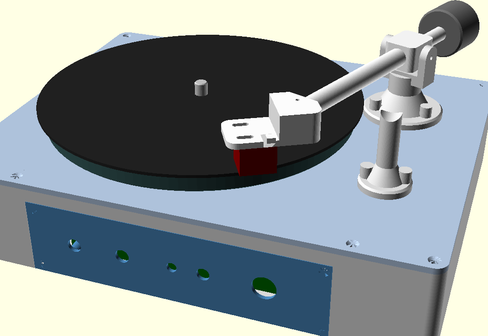
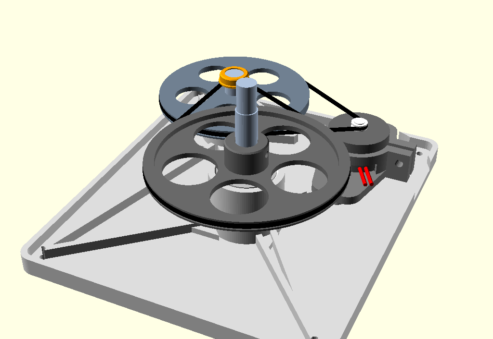
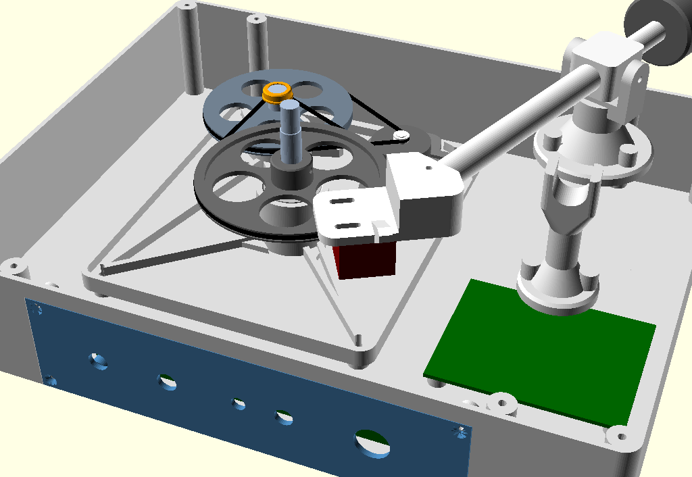

# Мини-проигрыватель виниловых пластинок

Параметрические модели корпуса и механики небольшого проигрывателя под
7" пластинки. Всё считается в OpenSCAD, печатается на FDM-принтере.

Стадия: **прототип №0**. Принцип работы — сначала получить крутящийся диск и
играющий тонарм, потом улучшать. Поэтому здесь сознательно нет обратной связи
по скорости, микролифта и антискейтинга (см. [Отложено](#отложено)).



## Что уже заложено

| Узел | Решение |
|---|---|
| Корпус | 250 x 200 x 50 мм, стенки 2 мм, поддон + верхняя часть на саморезах |
| Скругления | только вертикальные (боковые) рёбра, R6; верх и низ — острые |
| Диск | 170 мм, только 7" пластинки |
| Модуль вращения | отдельный «плагин» на своём шасси, ставится в поддон на 4 бобышки |
| Вал диска | стальной пруток 8 мм на двух 608ZZ, конец сточен до 7.1 мм под пластинку |
| Привод | RF-300C-14270, две ступени пассиков 1.2 мм, редукция 90:1 |
| Тонарм | поворотный, эффективная длина 130 мм, головка AT91 |
| Головка | съёмная площадка: гнездо под трубку с прижимным винтом, провод протягивается |
| Панель управления | отдельная деталь-вставка в передней стенке |
| Ножки | не предусмотрены: клеятся свои |

## Геометрия (считается автоматически)

При открытии любого файла OpenSCAD печатает сводку в консоль:

```
Габарит корпуса: 250 x 200 x 50 мм
Верх диска Z=60, рабочая плоскость пластинки Z=62.6
Отсек модуля вращения: X -93..40, Y -68..86, Z 7..42
Тонарм: L=130, вынос=17.9, разворот=30.9, ось качания Z=86.6
Погрешность тонарма на r=84: -0.53 град, на r=53: -0.32 град
```

Файлы модуля вращения добавляют к этому свою сводку — см.
[Модуль вращения](#модуль-вращения).

Система координат общая для всех деталей: X — вдоль широкой стороны, Y — вдоль
глубины (минус — передняя стенка), Z — вверх от внешней плоскости дна поддона.
Поэтому `assembly.scad` — это просто перечисление деталей без сдвигов, а любая
деталь открывается отдельно и стоит «на своём месте».

В `params.scad` и `drive/drive_params.scad` есть блоки `assert`-ов: они
проверяют, что противовес не вылезает за стенку на всём ходе тонарма, что
модуль вращения не выходит из своего отсека, что колёса не задевают друг
друга и башни, что пассики есть в наборе и так далее. Если поменять параметр
«неудачно», OpenSCAD откажется рендерить и скажет, что не так.

## Файлы

```
params.scad             все размеры проекта, производные величины, проверки
lib/common.scad         вспомогательные модули (скруглённая коробка, стойки, пазы)
assembly.scad           сборка целиком + болванки плат, пластинки, головки
parts/
  tray.scad                 поддон
  top_cover.scad            верхняя часть корпуса
  control_panel.scad        панель кнопок и регуляторов
  platter.scad              диск
  tonearm_base.scad         стойка тонарма
  tonearm_pin.scad          палец вертикальной оси
  tonearm_yoke.scad         вилка
  tonearm_arm.scad          ступица + трубка + хвостовик
  tonearm_headshell.scad    съёмная площадка головки звукоснимателя
  tonearm_counterweight.scad противовес
  tonearm_rest.scad         подставка тонарма
drive/                  модуль вращения — самостоятельный «плагин»
  drive_params.scad         его параметры, производные, проверки, сводка
  drive_lib.scad            общие куски шкивов
  drive.scad                drive_module(): узел в сборе + болванки покупного
  drive_assembly.scad       превью узла отдельно от проигрывателя
  parts/
    drive_chassis.scad          шасси: плита + две башни под 608ZZ
    drive_spindle_pulley.scad   колесо вала диска
    drive_spacer.scad           шайба под ним
    drive_idler_pulley.scad     большое колесо промвала
    drive_idler_cap.scad        колпачок-бортик промвала
    drive_motor_holder.scad     держатель двигателя
```

```sh
make -j4              # все STL в build/
make build/platter.stl
make drive            # только детали модуля вращения
make check            # прогнать все модели, поймать ошибки и незамкнутость
```

## Модуль вращения



### Зачем отдельный модуль

Привод — самая сырая часть проекта, её придётся переделывать много раз.
Поэтому всё, что крутит диск (вал, подшипники, колёса, двигатель), собрано на
собственном шасси и ставится в поддон как готовый узел — по аналогии с
панелью управления.

Поддон о приводе знает только **интерфейс**, он описан в `params.scad`:

* отсек `drive_bay`: от боковых стенок и передней стенки не ближе 30 мм (там
  будут динамики и плата управления), справа — до зоны тонарма и платы УМ;
* четыре бобышки `drive_mount_pos` под саморезы 2.5 x 8;
* потолок `drive_ceiling_z` — под рёбрами крышки, а в круге
  `spindle_keepout_d` вокруг вала, где рёбер нет, — почти до самой крышки;
* ось вала `platter_pos`, диаметр `spindle_d`, высота его верха.

Всё остальное живёт в `drive/`. Общая сборка вызывает только `drive_module()`
из `drive/drive.scad`. Другая реализация привода — это другая папка `drive/`
с тем же модулем и в тех же границах, поддон и крышка при этом не меняются.

Для работы с узлом есть `drive/drive_assembly.scad`: модуль в сборе, вокруг —
полупрозрачные поддон и разрешённый объём. Выключатели в начале файла:
диск сверху, разрез через оба вала и т.п.

### Кинематика

Двигатель RF-300C-14270 — около 3000 об/мин, диску нужно 33 1/3, то есть
редукция 90:1. Она разбита на две ступени:

1. **заводское колесо двигателя → большое колесо промвала** (62 мм), 11.3:1;
2. **промвал → колесо вала диска** (73.5 мм), 8:1. Здесь шкивом служит сам
   гладкий стальной промвал 8 мм, как тонвал в магнитофоне. Печатный шкив
   на валу получился бы минимум 11-12 мм — колёса выросли бы, а пассики
   перестали бы помещаться в набор.

Диаметры даны по средней линии пассика (дно канавки + толщина пассика).
Задаётся колесо промвала `idler_pulley_pd`, а колесо вала диска
пересчитывается так, чтобы при `motor_rpm` получалось ровно 33 1/3.
Межосевые и углы стоят в `drive_params.scad`, сводка при открытии любого
файла модуля:

```
Редукция: 11.3 x 8 = 90; двигатель 3000 -> промвал 266.1 -> диск 33.3 об/мин
Для 45 об/мин двигателю нужно 4050 об/мин
Колёса: промвал 62 мм (нар. 62.8), вал диска 73.5 мм (нар. 74.3)
Пассик 1: межосевое 55, путь 230.9 мм, охват 118 град -> брать ~107 по маркировке
Пассик 2: межосевое 58, путь 264.1 мм, охват 113 град -> брать ~123 по маркировке
Вал диска: пруток 8 мм длиной 66.1, сточить до 7.1 верхние 10.6 мм
Промвал: пруток 8 мм длиной 38
Плоскости пассиков: Z=31.2 и Z=36.7, дно двигателя Z=16.5 (дно держателя 3.5 мм)
```

**Пассики** — квадратные 1.2 мм из ремнабора. Маркировка таких наборов — это
«сложенная длина», половина окружности: самый большой «135» — это примерно
270 мм по кругу. Проверки требуют, чтобы оба пассика укладывались в 135 с
натягом 7 % (`belt_stretch`) и чтобы охват малых шкивов был не меньше 100
градусов. Если пассик не тянет, берётся следующий размер поменьше; первая
ступень дополнительно натягивается сдвигом держателя двигателя по пазам.

Скорость задаётся напряжением/ШИМ двигателя. Подбираются и 33, и 45 об/мин
(по стробоскопу или приложению-тахометру): двигатель допускает до 4 В, и
4050 об/мин для 45 укладываются с запасом.

### Валы и подшипники

Оба вала — отрезки стального прутка 8 мм, каждый в двух 608ZZ. Подшипники
запрессовываются в башни шасси: нижний — снизу, верхний — сверху, оба
упираются наружным кольцом в перемычку между гнёздами. Посадку гнезда правит
`brg_seat_clr`: проще напечатать пробную башню и подобрать.

Пруток проходит во внутреннее кольцо с зазором «в волос». Его надо выбрать,
иначе вал бьёт и может проворачиваться в кольце вместо подшипника. Модель
этого не решает, это делается при сборке:

1. **фольга** — один-два витка пищевой фольги (0.01-0.02 мм) на посадочном
   месте под каждым внутренним кольцом, без нахлёста по шву. Плотная посадка,
   полностью разборно — основной вариант, пока узел дорабатывается;
2. **кернение** посадочной шейки — 6-8 точек по окружности, выступы
   подогнать надфилем до тугой посадки;
3. **суперклей** — собрать насухо, выставить вал и капнуть жидкий клей на
   стык кольца с валом, его втянет в зазор. Разбирается только нагревом.

С фольгой порядок такой: вал с верхним подшипником вставляется сверху,
нижний подшипник надевается на вал снизу и запрессовывается одновременно на
вал и в гнездо — иначе фольга нижней посадки не пройдёт через верхнее кольцо.

По высоте вал зажат между двумя упорами, оба давят только на внутренние
кольца. Сверху — колесо: оно зажато на валу стопорным винтом M3 и через
шайбу `drive_spacer` (у промвала — пояском ступицы) стоит на верхнем
подшипнике. Снизу — кольцо из нескольких слоёв термоусадки под нижним
подшипником: не даёт вытянуть вал вверх, например вместе с диском. Через
верхний упор идёт и вес диска с пластинкой. Ступица колеса
поднимается в зону без рёбер крышки, поэтому винт оказывается над колесом,
и к нему есть подход сбоку. Верхний конец вала сточен до 7.1 мм: ступенька
прячется в ступице диска под матом, а сам диск зажимается своим стопорным
винтом уже на 8 мм.

У промвала колесо стоит сверху, а ступица уходит вниз, к подшипнику. Её
стопорный винт — под колесом. Над колесом — голый участок вала, по нему идёт
пассик 2. Снизу его ограничивает само колесо, сверху — напрессованный
колпачок `drive_idler_cap`. Участок вала под пассиком должен быть чистым,
без смазки — лучше слегка зашкурить для сцепления.

ZZ-подшипники с заводской смазкой заметно тормозят, а двигатель у нас
слабый (лучший КПД при ~3.8 г·см). Если не будет хватать момента — снять
пыльники с подшипников промвала, промыть их от смазки и капнуть жидкого масла.

### Двигатель

Держатель — стакан с хомутом: двигатель стоит в нём донцем, валом вверх,
обжимается стяжным винтом. Толщина дна держателя выставляет канавку
заводского колеса в плоскость пассика 1. Положение канавки
(`motor_groove_z`, 14.7 мм от донца) пока **оценочное — его надо измерить**.
Если оно другое, перепечатывается только держатель, шасси не меняется.
Провода выходят через вырез у дна стакана.



## Тонарм

Геометрия посчитана по Бервальду (Löfgren A) для рабочей зоны радиусов
53...84 мм, то есть под 7" сингл:

| Параметр | Значение |
|---|---|
| Эффективная длина (игла — ось) | 130 мм |
| Монтажное расстояние (ось — центр диска) | 112.1 мм |
| Вынос за центр диска | 17.9 мм |
| Разворот головки | 30.9 град |
| Нулевые точки | 56.0 и 77.4 мм |
| Максимальная погрешность тангенциальности | 0.57 град |

Трубка прямая, головка развёрнута. Угол между головкой и трубкой (около 40
град) и длина трубки не задаются руками, а выводятся из эффективной длины,
разворота и вылета головки — иначе при прямой трубке эти три величины
противоречат друг другу. Хочется другую длину тонарма — меняются
`arm_eff_len`, `arm_overhang`, `arm_offset_angle`, остальное пересчитается.

Кардан простейший: вертикальная ось — полый печатный палец в канале стойки со
смазкой, горизонтальная ось качания — два винта M3 с заточенными концами,
входящие в конусные гнёзда ступицы. Зазор выставляется глубиной завинчивания,
после настройки резьбу стоит зафиксировать лаком.

Площадка головки — **отдельная деталь**. Так сделано ради провода: пока
головка была единым целым с трубкой, канал оказывался заглушён её шеей и
завести провод было физически некуда. Теперь трубка открыта с торца, провод
протягивается насквозь до установки головки, а сама головка снимается — можно
поменять звукосниматель, не разбирая тонарм.

Сам стык предельно простой: на задней части площадки поднят «нарост» того же
контура, в нём наклонное гнездо под трубку, а задний угол срезан одной
плоскостью перпендикулярно трубке — это вход гнезда. Трубка входит на 9 мм до
упора в глухое дно и тянется винтом M2.5 сверху по лыске. Дно задаёт
эффективную длину, лыска — угол разворота, так что после снятия-установки
геометрия не уезжает.

Размеры площадки не выставлены руками: ширина, задний свес и высота нароста
проверяются assert'ами на то, что вход гнезда целиком лежит в контуре и что
вокруг него остаётся материал. Меняется угол разворота или диаметр трубки —
проверки скажут, что править. Подставка ловит трубку перед наростом, чтобы
вес тонарма ложился на саму трубку, а не на съёмную деталь и её винт.

Сигнальный провод от AT91 идёт внутри трубки, выходит вниз из ступицы, через
полый палец и стойку — внутрь корпуса. Со стороны головки он выходит снизу
площадки сразу позади корпуса звукоснимателя — как раз к его лепесткам.
Токосъёмных колец нет: слабина провода работает и проводником, и мягким
ограничителем поворота.

Настройка при сборке:

* **прижимная сила** — массой и положением противовеса. Стакан противовеса
  засыпается дробью или гайками М8 и заливается эпоксидкой. По расчёту масс
  печатных деталей для AT91 при VTF 2 г нужно около 37 г на вылете 45 мм, то
  есть сам стакан (~9 г) плюс ~28 г засыпки — стакан надо заполнять почти
  целиком, лучше стальной или свинцовой дробью. Точная настройка — сдвигом по
  хвостовику, ход даёт запас больше грамма VTF. Проверять весами для тонарма
  или ювелирными;
* **вынос** — пазами крепления головки, +-4 мм. Выставляется шаблоном
  (протрактор печатается отдельно или печатается на бумаге);
* **высота (VTA)** заложена жёстко: ось качания стоит на
  `игла + высота головки + площадка`. Если головка окажется другой —
  меняется `cart_height`, и стойка станет выше или ниже.

Подставка тонарма приподнимает трубку на 5 мм, чтобы игла гарантированно не
касалась ни пластинки, ни крышки. Трубка ложится в U-образное ложе со
стенками до её верха, поэтому при переноске не съезжает вбок. Вдавливать её
никуда не нужно: защёлкивание нагружало бы оси качания. Тонарм снимается
с подставки рукой за пальцевой упор — микролифта нет.

## Панель управления

Смысл этой детали — модульность, как заглушки портов в корпусах ПК: под неё в
передней стенке поддона сделано окно с четвертью (панель встаёт заподлицо) и
четыре крепёжные бобышки. Плата кнопок и регуляторов крепится к самой панельке
на четыре стойки, поэтому панель с платой снимается и ставится как один узел.

Сейчас в панели: два потенциометра (громкость + задел под тембр), светодиод,
выключатель питания и кнопка. Список отверстий — это просто массивы координат
в `params.scad` (`panel_pot_x`, `panel_btn_x`, ...). Захотелось тембр, линейный
выход или гнездо наушников — правится только панель и её плата, поддон
остаётся прежним.

## Печать

Материал: PLA или PETG. Механически нагруженные мелочи (палец, ступицы
колёс) — 100% заполнение.

| Деталь | Ориентация |
|---|---|
| Поддон | как есть, дном на стол, без поддержек |
| Крышка | перевернуть: наружной плоскостью на стол (бортик и рёбра вверх) |
| Панель управления | лицом на стол |
| Диск | перевернуть: рабочей плоскостью на стол |
| Палец тонарма | стоя, 100% заполнение |
| Шасси модуля вращения | плитой на стол, без поддержек |
| Колесо вала диска | диском на стол, ступица вверх |
| Колесо промвала | перевернуть: диском на стол, ступица вверх |
| Держатель двигателя, шайба, колпачок | как есть, плашмя |
| Стойка тонарма, подставка | основанием на стол |
| Вилка | нижней плоскостью траверсы на стол |
| Трубка тонарма | лежа: ступица на столе, под трубку лёгкие поддержки |
| Головка | площадкой на стол, наростом вверх, без поддержек |
| Противовес | стоя, открытой полостью вверх |

Крышка 250x200x3 мм сама по себе «играет», поэтому снизу у неё сетка рёбер
жёсткости с вырезами под стойки поддона и крепёж тонарма.

## Крепёж и покупное

* саморезы с потайной головкой 3 x 12 — 8 шт (крышка к поддону);
* саморезы 2.5 x 10 — 4 шт (панель), 2.5 x 12 — 5 шт (стойка и подставка
  тонарма вкручиваются изнутри корпуса), 2.5 x 8 — 4 шт (плата), ещё 2.5 x 8
  — 6 шт (шасси модуля вращения к поддону и держатель двигателя к шасси);
* саморез 3 x 16 — стяжка хомута держателя двигателя;
* винты M3: 2 шт с заточенным концом (оси качания), 4 шт стопорных (два
  колеса модуля вращения, ступица диска, противовес);
* двигатель RF-300C-14270 с заводским колесом;
* подшипники 608ZZ — 4 шт, стальной пруток 8 мм (~66 + ~38 мм), термоусадка
  на упорные кольца, пищевая фольга на посадку вала в подшипники;
* пассики квадратные 1.2 мм, ~107 и ~123 по маркировке (см. сводку модуля);
* винт M2.5 x 8 — прижимной для гнезда трубки в головке;
* головка звукоснимателя Audio-Technica AT91, крепёж 1/2" винтами M2 (пазы
  площадки сделаны под M2: под M2.5 головка винта почти проваливается в паз);
* мат на диск: войлок или резина, диаметр 164 мм, толщина 2 мм;
* густая смазка для вертикальной оси тонарма;
* дробь или гайки М8 и эпоксидка — засыпка противовеса.

## Порядок сборки

1. Собрать модуль вращения отдельно, на столе: отрезать валы по сводке,
   сточить конец вала диска до 7.1 мм. Верхние подшипники посадить на валы
   (с фольгой) и запрессовать в башни сверху, нижние надеть на валы снизу и
   запрессовать в гнёзда. Под нижними подшипниками усадить на вал упорные
   кольца из термоусадки, прижимая их к внутреннему кольцу.
2. Вал диска: надеть шайбу и колесо, поджать колесо к подшипнику (выбрать
   осевой люфт) и затянуть стопорный винт. Промвал: так же, колесо поясом
   ступицы к подшипнику, винт, колпачок на верхний конец.
3. Двигатель — в держатель, стянуть хомут, держатель на шасси. Накинуть оба
   пассика, натянуть первый сдвигом держателя по пазам. Проверить вращение
   прямо на столе. Готовый модуль поставить в поддон на четыре самореза.
4. Поставить платы: фонокорректор/УМ на стойки в поддоне, плату управления —
   на панельку; панельку завести в окно передней стенки.
5. К крышке снизу привинтить стойку тонарма и подставку.
6. Протянуть сигнальный провод: с открытого торца трубки к ступице и вниз
   через её отверстие — с запасом на оба конца. Головку пока не ставить,
   иначе провод не завести.
7. Собрать тонарм: палец в вилку (с натягом), вилку — в стойку, ступицу — в
   вилку на винтах-осях, выставить зазор качания; нижний конец провода
   спустить через палец и стойку внутрь корпуса, оставив слабину на весь
   ход поворота.
8. Припаять верхний конец к лепесткам AT91, надеть головку на трубку до
   упора в дно гнезда, затянуть прижимной винт по лыске, привинтить головку
   в пазы.
9. Закрыть крышку восемью саморезами, надеть диск на вал, зафиксировать
   стопорным винтом через отверстие в ободе, положить мат.
10. Настроить прижимную силу и вынос, подобрать обороты.

## Отложено

Сознательно не сделано на этом этапе, но место под это есть или будет:

* **динамик** — будет где-то в корпусе, посадочное место ещё не выбрано;
* **батарейный отсек** — тоже отдельная задача, вместе с выбором питания;
* **микролифт тонарма** — возможная доработка, пока подъём рукой;
* **обратная связь по скорости вращения** — пока разомкнутая схема, обороты
  подбираются напряжением/ШИМ;
* **антискейтинг** — на прототипе нет;
* **виброразвязка двигателя** — держатель пока жёстко на шасси;
* **пылезащитная крышка** — не проектировалась;
* **регулировка VTA** — высота оси качания задана расчётом, без механизма;
* **подшипники в вертикальной оси тонарма** — MR106 вместо печатного канала;
* **разъёмы на задней стенке** (линейный выход, питание) — появятся вместе с
  питанием и усилителем;
* **протрактор** для выставления выноса — напечатать отдельной деталью.
